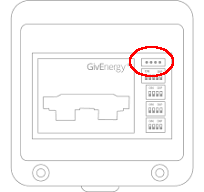
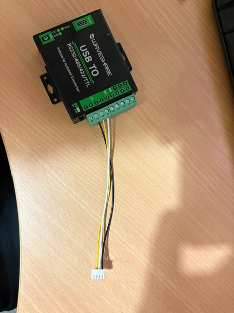
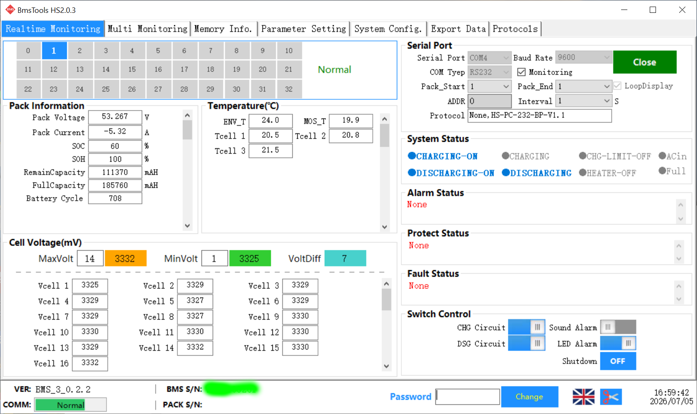
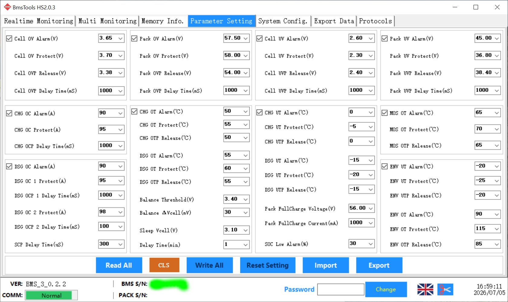

# PACE BMS Tools

The PACE BMS is used inside GivEnergy batteries.  Gen 2 / Gen 3 batteries have an external RS232 connector that can be used to directly access the BMS to see the BMS status and configuration (and potentially re-configure).

## Hardware
The connector is located under the DC MCB / DIP Switch cover in the top-right corner.  The connector is compatible with JST 2.5mm XH 4-pin plugs.



The pins are:

```
 +-----+-----+-----+-----+
 | +VE | RXD | TXD | GND |
 +-----+-----+-----+-----+
```

> It is **STRONGLY** recommended not to connect the +ve pin as the BMS is already powered via the battery.

To use the PACE BMS tools, an RS232 USB adapter with voltage protection is recommended, such as the Waveshare [USB to RS232/485/TTL](https://www.waveshare.com/wiki/USB_TO_RS232/485/422/TTL).

The JST XH connectors are very popular, and pre-wired JST XH connectors are available from Amazon.

An example of the correct wiring for the Waveshare device is shown (note the +ve terminal is not connected and the plug orientation, with the metal elements showing):



## Software

The PACE bmstools software is available from several forums on the Internet.  One version known to work is `PbmsTools HS2.0.3`.

In bmstools, select the correct serial port and 'Open'

The two most useful screens appear to be 'Realtime Monitoring' and 'Parameter Setting'.  These two examples are from a Gen 2 9.5kWh battery:



